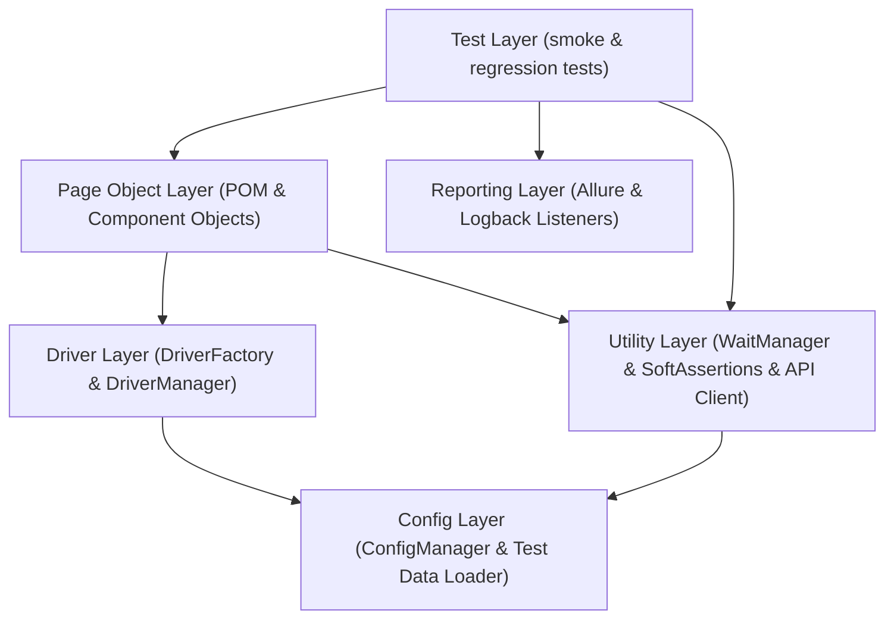
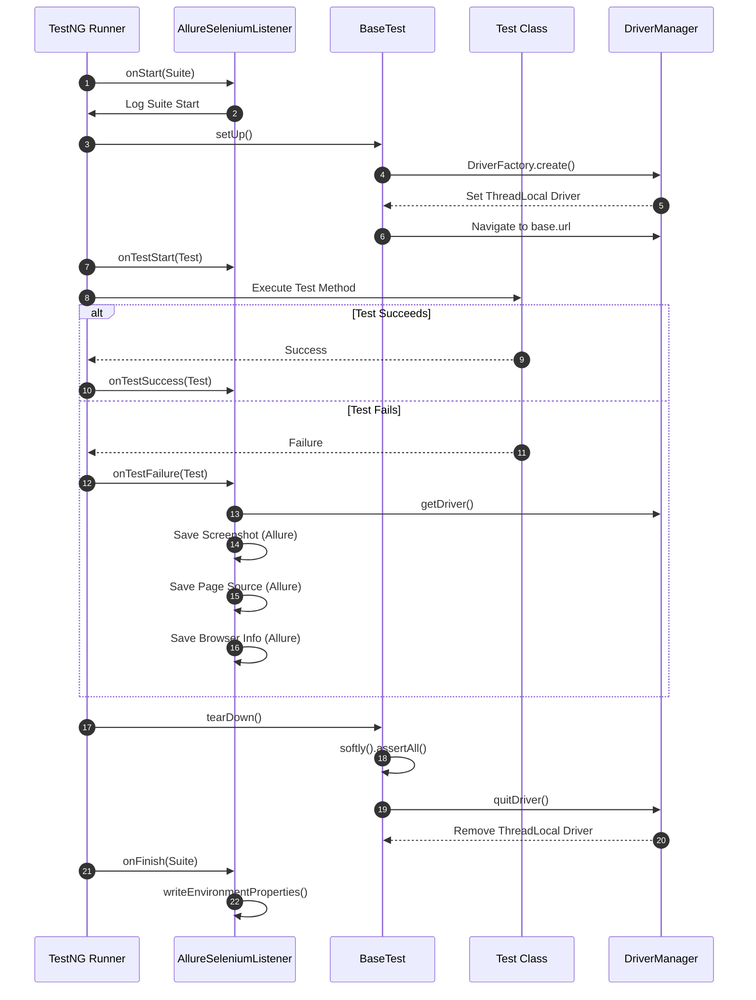
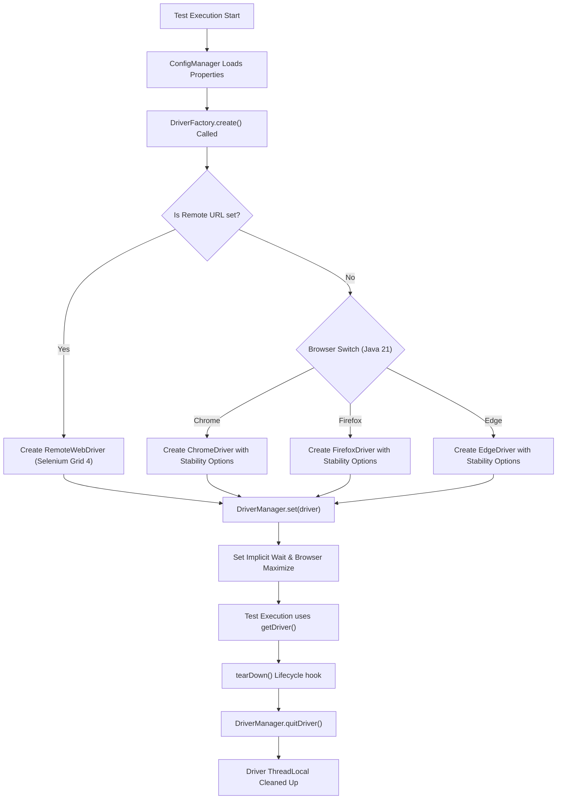

# Framework Architecture

This document describes the design decisions, component patterns, and layered architecture of the `web-selenium-java-framework` platform.

## Architecture Layers

---

## Test Execution Lifecycle

---

## WebDriver Lifecycle

---

## Design Decisions & Rationale

### 1. Why PageFactory is Forbidden

PageFactory relies on lazy loading using `@FindBy` annotations, which delays locating element locator strategies until the element is actually interacted with. This often leads to silent `StaleElementReferenceException` errors or unexpected timing bugs in complex applications. By avoiding PageFactory and using `By` locators with explicit waits in `BasePage`, we gain complete control over element synchronization.

### 2. Why ThreadLocal WebDriver

To run tests concurrently in multiple threads (using TestNG's parallel execution features), the `DriverManager` isolates each thread's `WebDriver` instance. This prevents cross-thread interference and ensures zero shared mutable browser state.

### 3. Why Java Records for Test Data

Java 21 `record` classes are used for test data models (such as `UserData` and `ProductData`). They are immutable by design, clean, and provide built-in constructors, getters, `equals()`, `hashCode()`, and `toString()` methods automatically, reducing boilerplates.

### 4. Why Explicit Waits Everywhere

Implicit waits are dangerous when mixed with explicit waits because they cause the driver to block repeatedly. In this framework, implicit waits are set to a low threshold (or 0), and all page actions route through `WaitManager` using explicit `WebDriverWait` rules (such as `visibilityOfElementLocated`).

### 5. Why BiDi-Ready

Selenium 4 WebDriver BiDi support enables bidirectional event streaming (e.g. listening to console log events, network request interception). A toggle `bidi.enabled` is included in our `DriverFactory` to easily transition features from traditional CDP commands to W3C standardized BiDi protocols.

### 6. Why Selenium Manager

We rely on native Selenium Manager (introduced in Selenium 4.6+) rather than the third-party `WebDriverManager` library. Selenium Manager automatically resolves and downloads browser binaries at runtime without external dependencies, resulting in a zero-configuration setup for local and CI/CD pipelines.

---

## Anti-Patterns Catalog

The following design behaviors are strictly forbidden in this codebase:

1. **`Thread.sleep()`**: Causes arbitrary test execution delays and leads to flaky builds. Always use explicit waits.
2. **Implicit Element Lookups**: Using `driver.findElement()` directly without enclosing explicit waits.
3. **Static WebDriver References**: Breaks parallel execution instantly. Always retrieve WebDriver instances via `DriverManager.getDriver()`.
4. **PageFactory Annotations**: Using `@FindBy` annotations is disallowed.
5. **Swallowing NoSuchElementException**: Catching raw exceptions to return `false` on visibility checks instead of invoking proper waits.
6. **Hardcoding Test Data**: Hardcoding credentials or environment URLs inside test classes. Use `ConfigManager` or test data factories.
7. **Assertions in Page Objects**: Page Objects should capture page state or return other pages, never execute test validations. Keep assertions in the Test classes.
8. **Interacting with Invisible Elements**: Attempting to click or type on elements without waiting for them to be interactable.

---

## Extension Guide

### How to Add a New Browser

1. Open `com.qaframework.driver.BrowserType` and add the new browser enum value.
2. Open `com.qaframework.driver.DriverFactory` and update the `switch` expression to handle the new browser options and instantiation.

### How to Add a New Environment

1. Create a new properties file under `src/test/resources/config/` (e.g., `stage.properties`).
2. Add necessary config keys: `base.url`, `browser`, etc.
3. Run tests with `-Denv=stage`.

### How to Add a New Page Object

1. Create your page class extending `com.qaframework.pages.BasePage`.
2. Define private static final `By` locators.
3. Write page methods with `@Step` annotations returning either `this` or next landing pages.
